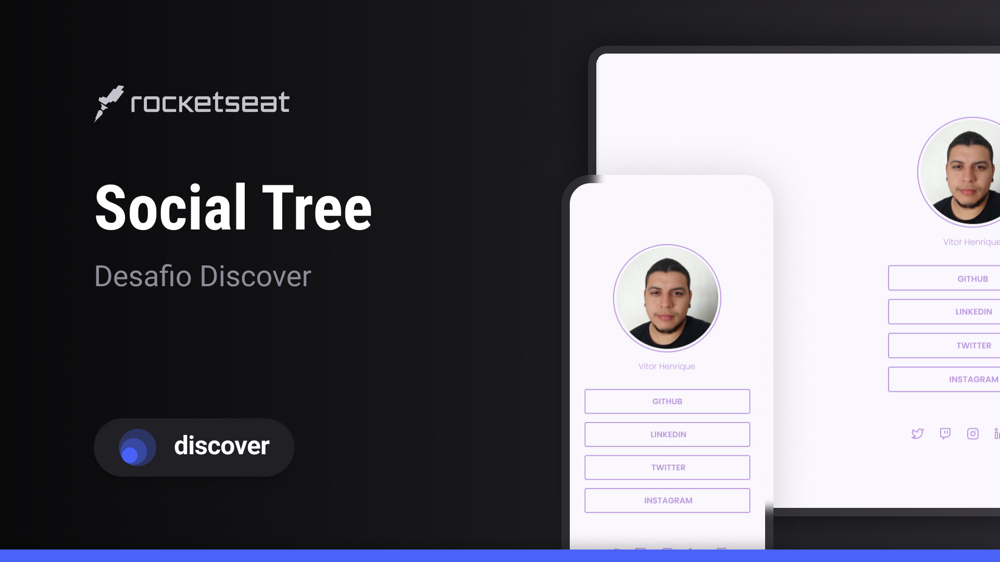

<h1 align="center"> Social Tree </h1>

Projeto desenvolvido apartir dos desafios praticos do programa exclusivo e gratuito, promovido pela <a href="https://github.com/rocketseat-education">Rocketseat</a> para ensino de tecnologias WEB.  
Conheça o projeto <a href="https://lp.rocketseat.com.br/devlinks/inscricao?utm_source=github&utm_medium=descricao&utm_campaign=capture-devlinks&utm_term=organic&utm_content=descricao-github-mayk-brito">clicando aqui.</a>

  <a href="#-tecnologias">Tecnologias</a>&nbsp;&nbsp;&nbsp;|&nbsp;&nbsp;&nbsp;
  <a href="#-projeto">Projeto</a>&nbsp;&nbsp;&nbsp;|&nbsp;&nbsp;&nbsp;
  <a href="#memo-licença">Licença</a>

  

 

  

## 🚀 Tecnologias

Esse projeto foi desenvolvido com as seguintes tecnologias:

- HTML
- CSS
- Figma

## 💻 Projeto

O Social Tree é uma página com uma lista de links que pode ser usada em perfis de redes sociais.

- [Link do projeto finalizado](https://social-tree-iota.vercel.app/)

## :memo: Licença

Esse projeto está sob a licença MIT.

---
